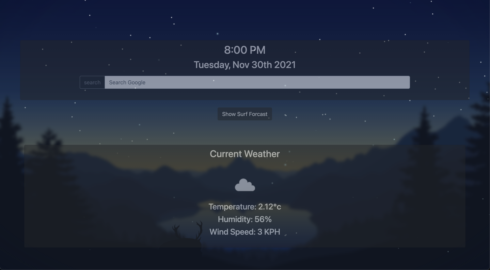

# Custome Chrome new tab extension

# Table of Contents

- [Author](##Author)
- [Project Description](##Description)
- [Install](##Install)
- [Usage](##Usage)
- [Testing](##Testing)
- [License](##License)
- [Contributors](##Contributors)
- [Questions](##Questions)

## Author

Name: John Murphy
GitHub: jmurphy0

## Description

Creates a custome new tab page displaying local weather, a time dependent dynamic background and local surf conditions.

## Install

1. Clone or download this repository from github
2. Create a file called config.js within the root directory.
3. Obtain a free API keys from both sites listed below:

   i. https://openweathermap.org
   ii. https://stormglass.io

4. In the config.js file type:

   var config = {

openWeatherKey: “your open weather key”,
stormglassKey:
“your stormglass key”,
};

using the api keys aquired in step 3.

5. save files.
6. Open Chrome extension page and navagate to "load unpack", select this root directory.
7. Open new tab and allow location when propmted.

## Usage

Surf data is limited to 50 calls per day with free usage. Surf data location can be changed by hardcoding coordinates of a desired location within the script.js file.

## Testing

## License

## Contributors

## Questions

